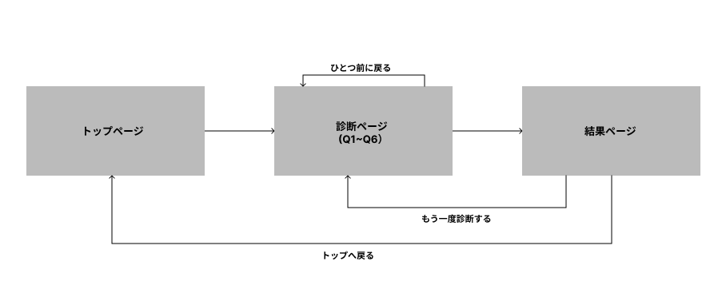
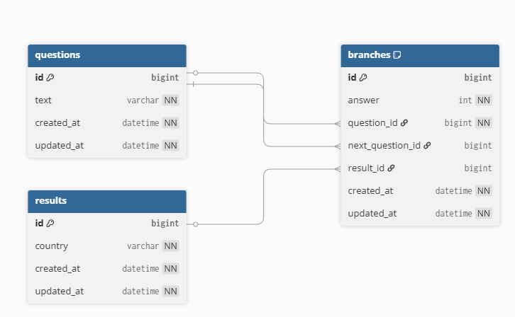

# Coffee Compass

## アプリを作った理由
- コーヒー選びに迷ったときに、簡単な質問で好みに合う一杯へたどり着ける体験を作りたかったため

## できること（機能一覧）
- 診断の開始
- 質問への回答（Yes/No）
- 直前の質問へ戻る
- 診断結果の表示

## 技術スタック
- Ruby on Rails 7.2
- PostgreSQL
- Hotwire (Turbo/Stimulus)
- Tailwind CSS

## 画面遷移図

## ER図

## 今後の改善ポイント
- 質問・結果の管理画面の追加
- コーヒー豆の画像や説明の充実
- 診断結果の共有機能
- 診断の進捗表示（例：全6問中「3/6」やプログレスバー）

## デプロイ
- Renderで公開
- URL: https://coffee-compass-87m5.onrender.com/test/8/result
